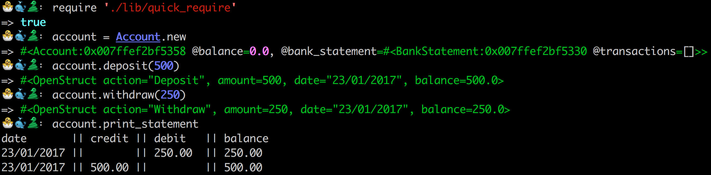

## Bank tech test

A short tech test to be completed in a couple of hours. The following requirements were given:

You should be able to interact with the your code via a REPL like IRB or the JavaScript console. (You don't need to implement a command line interface that takes input from STDIN.)\n
Deposits, withdrawal.\n
Account statement (date, amount, balance) printing.\n
Data can be kept in memory (it doesn't need to be stored to a database or anything).

#### My approach

I started by writing a list of the message which would need to be sent to meet these requirements. Using these I decided two classes and a module would be required. I then set about creating them one at a time following the SOLID principles to the best of my ability.

#### Try it out

1. Clone this repo into a local depository on your machine.
2. Install(gem install bundle) and run 'bundle'
3. Open your favourite REPL (pry, irb, etc..)
4. Require './lib/quick_require'
5. Create an account with Account.new, deposit(.deposit), withdraw(.withdraw) and print your statement(.bank_statement.print_statement)

#### Run the tests

If you tried it out you should already have the repo and have bundle installed, if you didn't see steps 1 + 2 above. Open your terminal and run rspec.
